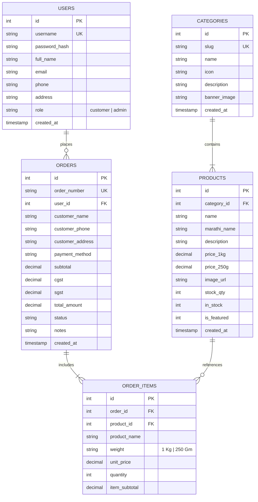
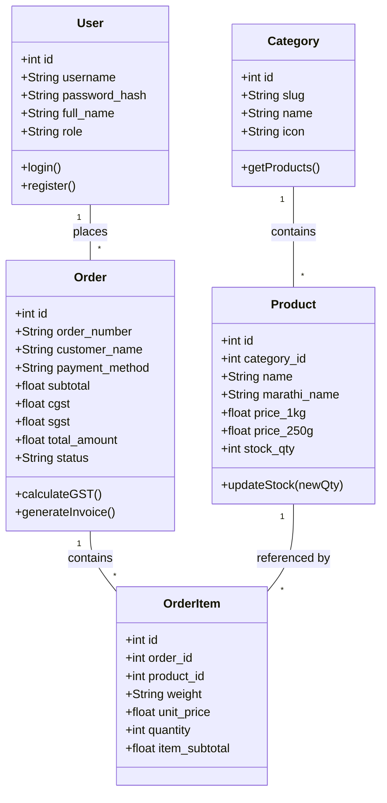
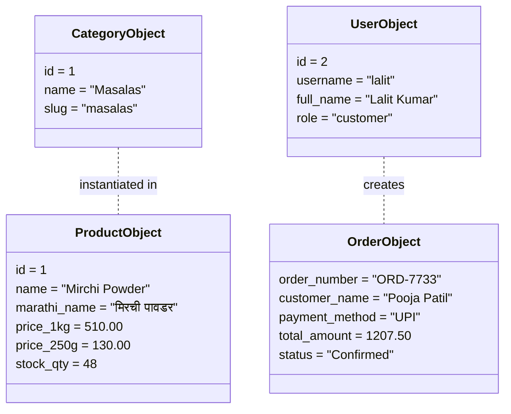
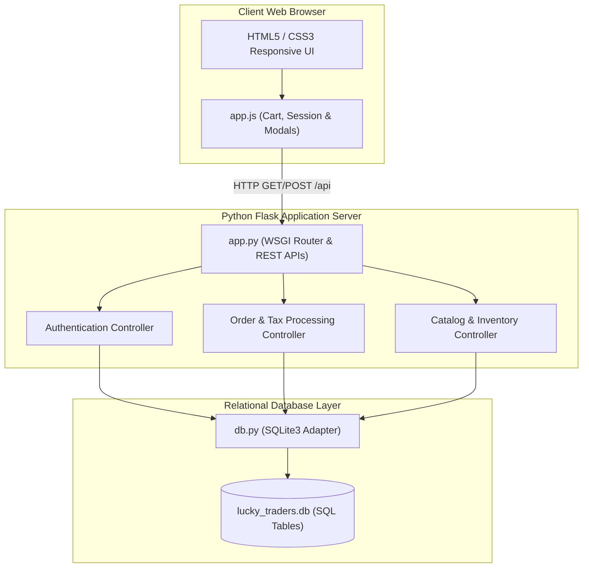
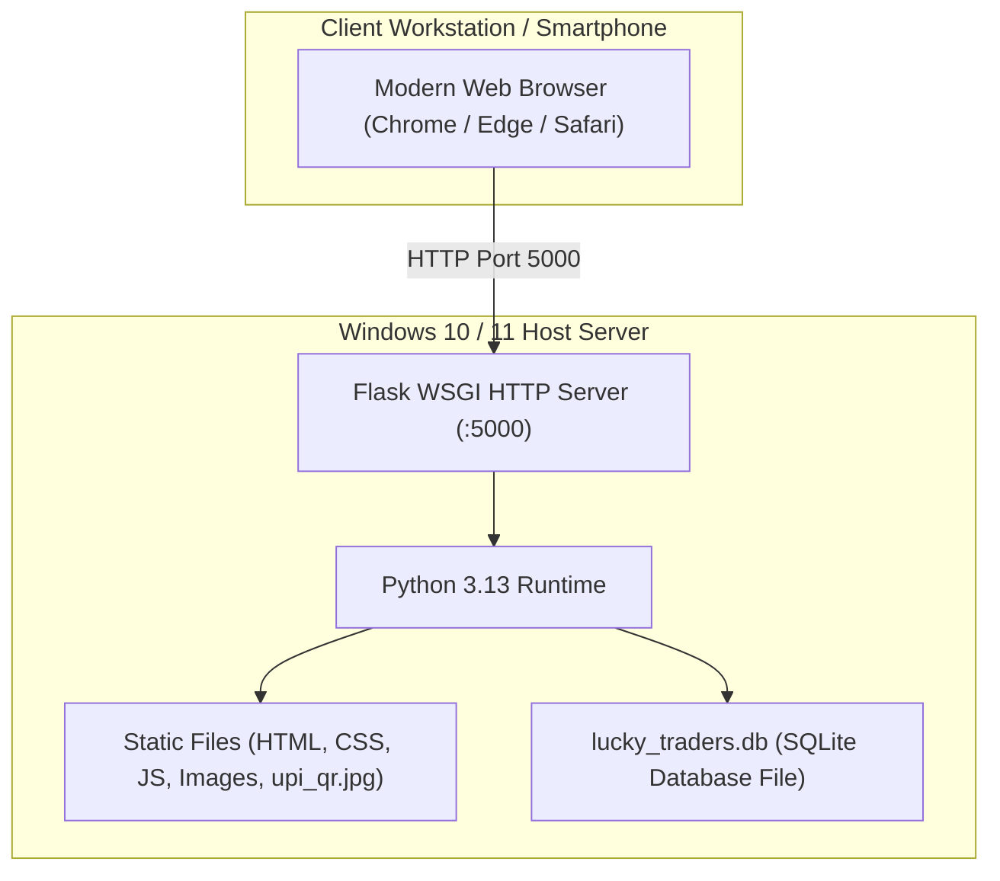
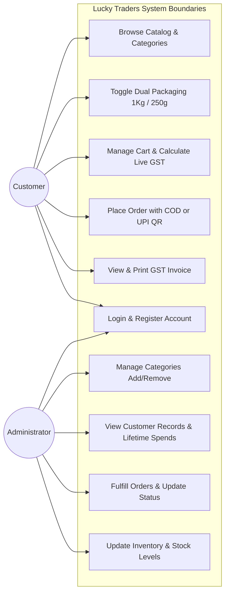
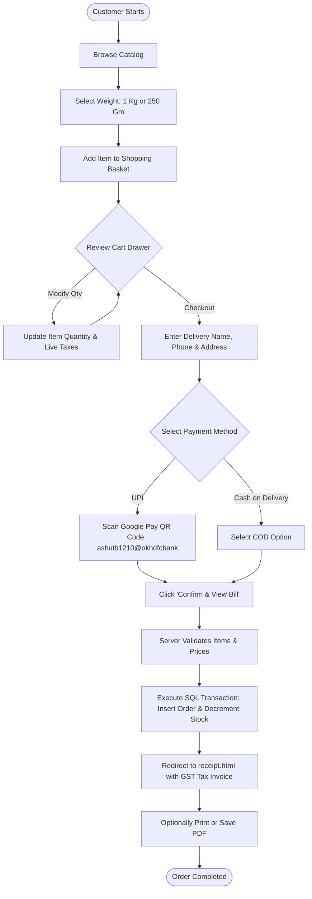
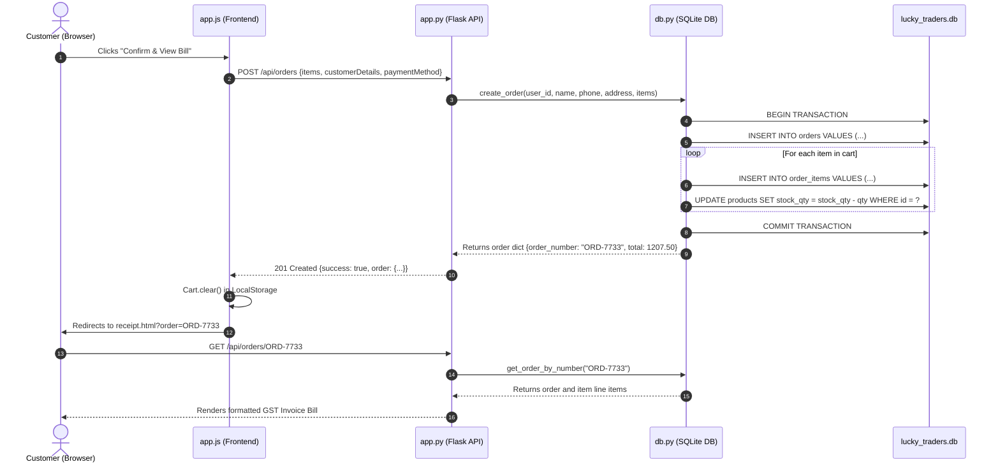

# 🎓 SAVITRIBAI PHULE PUNE UNIVERSITY, PUNE
## T. Y. B. Sc. (Computer Science) — Semester V
### NEP CBCS Pattern 2026-27 | Major: Computer Science
### Course Code: CS-331-FP | Course Title: Project (FP/OJT/CEP)

---

# 📦 PROJECT WORK DOCUMENTATION REPORT
## Project Title: **Lucky Traders — Full-Stack Spices & Condiments Web Application with Real-Time SQL Inventory & GST Billing System**

---

### 📋 ACADEMIC INFORMATION

| Parameter | Details |
|---|---|
| **University** | Savitribai Phule Pune University (SPPU), Pune |
| **Faculty** | Science and Technology |
| **Degree** | Bachelor of Science (Computer Science) — T.Y.B.Sc. (Sem - V) |
| **Course Code & Title** | **CS-331-FP: Project** |
| **Course Type** | FP / OJT / CEP (Credits: 2, Teaching Scheme: 4 Hours/Week) |
| **Operating Environment** | Windows 10 / 11 |
| **Examination Scheme** | Continuous Evaluation (CE): **15 Marks** \| End Semester Evaluation (EE): **35 Marks** \| **Total: 50 Marks** |
| **Academic Year** | 2026 – 2027 |

---

### 📊 EVALUATION SCHEME MAPPING

```
Total Evaluation: 50 Marks
├── Continuous Evaluation (CE) - 15 Marks
│   ├── First Presentation:  7 Marks
│   └── Second Presentation: 8 Marks
└── End Semester Evaluation (EE) - 35 Marks
    ├── Project Logic / Presentation: 15 Marks
    ├── Project Documentation:        10 Marks  <-- (Addressed by this Report)
    └── Viva Voce:                    10 Marks
```

---

## 📑 TABLE OF CONTENTS (INDEX)
*As prescribed by SPPU Syllabus Guidelines for CS-331-FP*

| Sr. No. | Section Title | Page / Section |
|:---:|---|:---:|
| **1** | **Preliminary Investigation** | **Section 1** |
| | 1.1 Problem Identification | 1.1 |
| | 1.2 Problem Statement / Definition | 1.2 |
| | 1.3 Purpose, Objectives, and Goals | 1.3 |
| | 1.4 Feasibility Study (Technical, Operational, Economic) | 1.4 |
| | 1.5 Project Scope and Limitations | 1.5 |
| **2** | **Requirement Specification** | **Section 2** |
| | 2.1 System Requirements (Hardware / Software Specifications) | 2.1 |
| | 2.2 Technical Requirements (Languages, Frameworks, Tools) | 2.2 |
| | 2.3 Functional Requirements | 2.3 |
| | 2.4 Data, Performance & Security Requirements | 2.4 |
| **3** | **Database Design** | **Section 3** |
| | 3.1 End Users of the System | 3.1 |
| | 3.2 Entity-Relationship (ER) Diagram | 3.2 |
| | 3.3 Relational Tables, Data Dictionary, and Relationships | 3.3 |
| **4** | **System Design (UML Modeling)** | **Section 4** |
| | 4.1 Class Diagram | 4.1 |
| | 4.2 Object Diagram | 4.2 |
| | 4.3 Component Diagram | 4.3 |
| | 4.4 Deployment Diagram | 4.4 |
| | 4.5 Use Case Diagram | 4.5 |
| | 4.6 Activity Diagram | 4.6 |
| | 4.7 Sequence Diagram | 4.7 |
| **5** | **Input and Output Screen Layout** | **Section 5** |
| **6** | **Bibliography / References** | **Section 6** |

---

# 1. PRELIMINARY INVESTIGATION

### 1.1 Problem Identification
Traditional retail businesses dealing in Maharashtrian agricultural condiments, authentic stone-ground masalas, dry roasted chutneys, and sun-cured pickles (such as Lucky Traders in Hadapsar, Pune) conduct their daily operations primarily through manual paper logbooks and offline cash receipts. 

During the preliminary investigation, several major challenges in the existing manual process were observed:
1. **Manual Inventory Ledger Discrepancies:** Stock depletion is calculated post-sale, leading to stockouts during peak festival seasons.
2. **Dual-Weight Packaging Inaccuracies:** Products are sold in multiple packaging weights (`1 Kg` bulk pack and `250 Gm` family trial pack) with non-linear pricing. Manual billing often leads to human arithmetic errors.
3. **Lack of Digital Localization:** Mainstream global e-commerce portals do not display authentic regional nomenclature in Marathi script (e.g., *बेडगी मिरची पावडर, कांदा लसुण मसाला, शेंगदाणा चटणी, आंबा लोणचे*), alienating traditional regional consumers.
4. **Non-Standardized Invoicing:** Lack of computerized GST tax calculations (2.5% CGST + 2.5% SGST) creates auditing difficulties.
5. **Slow Digital Payment Reconciliation:** Offline customers require quick UPI QR scanning without cumbersome registration hurdles.

### 1.2 Problem Statement / Definition
> **"To design, develop, and evaluate a lightweight, responsive, full-stack web application for 'Lucky Traders' using Python and a Relational SQL Database that streamlines role-based authentication, dual-weight product browsing, image-rich shopping cart management, seamless UPI and Cash-on-Delivery checkout, dynamic GST tax invoice generation, and real-time administrative stock decrement."**

### 1.3 Purpose, Objectives, and Goals

#### Purpose:
To transition an authentic regional condiment retailer from error-prone manual bookkeeping to an automated, auditable, and accessible web-based digital storefront and management system.

#### Course Outcomes (CO) Alignment:
- **CO1 (Problem Identification & Scope):** Clearly identified local retail bottlenecks and scoped a full-stack digital solution.
- **CO2 (Requirements & Methodologies):** Structured system requirements and software models using standard SDLC principles.
- **CO3 (Implementation):** Developed backend using Python Flask and frontend using HTML5, CSS3, and ES6 JavaScript.
- **CO4 (Database Management):** Implemented a normalized relational SQL database using SQLite3 with transaction management.
- **CO5 (Demonstration & Teamwork):** Conducted presentations meeting SPPU CE and EE evaluation rubrics.
- **CO6 (Academic Documentation):** Prepared this structured project documentation according to Savitribai Phule Pune University standards.

#### Measurable Goals:
1. **Catalog Completeness:** 100% online availability of 20 standardized products categorized under Masalas, Dry Chutneys, and Pickles.
2. **Dual-Weight Toggle:** 1-click seamless client-side toggling between `1 Kg` and `250 Gm` with instant price updates.
3. **Atomic Stock Decrement:** Auto-deduction of inventory in SQL at the exact millisecond an order is confirmed.
4. **Dynamic Billing:** Instant creation of print-ready GST invoices with order tracking numbers (`ORD-XXXX`).
5. **Real-Time Admin Oversight:** Instant administrative insights into revenue, order status transitions, registered customers, and low-stock alerts.

### 1.4 Feasibility Study

#### A. Technical Feasibility
- **Platform Compatibility:** Operates on standard Windows 10/11 environments as required by the SPPU syllabus.
- **Tech Stack Reliability:** Python 3.x is globally acknowledged for backend efficiency and code maintainability. Flask is a lightweight WSGI microframework providing low latency.
- **Database Availability:** SQLite3 is integrated directly into Python's standard library, requiring zero separate server installation or network overhead while providing full ACID (Atomicity, Consistency, Isolation, Durability) relational database compliance.
- **Zero Third-Party Frontend Dependencies:** The client interface uses pure semantic HTML5, CSS3 Grid/Flexbox, and vanilla JavaScript without heavy third-party framework overhead.
- **Conclusion:** **Highly Feasible Technically.**

#### B. Operational Feasibility
- **Usability for Consumers:** Intuitive user journey: Browse $\rightarrow$ Select Weight $\rightarrow$ Add to Cart $\rightarrow$ Delivery Info $\rightarrow$ Scan QR / Select COD $\rightarrow$ View Bill.
- **Bilingual Interface:** English + Marathi script ensures high adoption across demographics in Maharashtra.
- **Administrative Ease:** Single unified administrative dashboard with tabbed navigation requiring minimal technical training.
- **Conclusion:** **Highly Feasible Operationally.**

#### C. Economic Feasibility
- **Development Cost:** ₹0 (built entirely using open-source tools: Python, SQLite, HTML5/CSS3/JS, VS Code).
- **Deployment & Hosting:** Capable of running locally or deployed on free/low-cost cloud tiers (Render, PythonAnywhere).
- **Hardware Overhead:** Runs smoothly on existing consumer PC hardware (2 GB RAM minimum).
- **Return on Investment:** Completely eliminates paper ledger wastage and calculation losses.
- **Conclusion:** **Highly Feasible Economically.**

### 1.5 Project Scope and Limitations

#### Scope:
- Complete storefront browsing with category tabs and real-time search.
- Dual-weight pricing architecture (`1 Kg` & `250 Gm`) across all catalog items.
- Persistent local shopping cart drawer with item image thumbnails and live 5% GST calculation.
- Dual-role authentication system (`Customer` and `Administrator`).
- Integrated UPI payment via official Google Pay QR code (`ashutb1210@okhdfcbank` — Ashwini Bramhankar) and Cash on Delivery.
- Computer-generated GST tax invoice receipt with print and PDF stylesheet formatting.
- Admin dashboard for Category CRUD, Customer CRM, Order status updates, and stock replenishment.

#### Limitations & Future Enhancements:
- Payment gateway uses UPI QR code scanning and COD confirmation; real-time bank webhook integration is planned for Phase 2.
- Currently designed for local/regional delivery in Pune with nationwide expansion in future phases.

---

# 2. REQUIREMENT SPECIFICATION

### 2.1 System Requirements (Hardware / Software Specifications)

#### Hardware Requirements (Client & Development Machine):
| Component | Minimum Specification | Recommended Specification |
|---|---|---|
| **Processor** | Intel Core i3 / AMD Ryzen 3 (2.0 GHz) | Intel Core i5 / Ryzen 5 or higher |
| **RAM** | 2 GB DDR3 | 8 GB DDR4 |
| **Hard Disk Storage** | 500 MB free storage | 2 GB SSD storage |
| **Display** | 1024 x 768 Screen Resolution | 1920 x 1080 Full HD |
| **Peripherals** | Keyboard, Mouse, Internet / LAN | Keyboard, Mouse, High-speed Internet |

#### Software Requirements:
| Software / Environment | Specification |
|---|---|
| **Operating System** | Windows 10 / Windows 11 (64-bit) |
| **Backend Runtime** | Python 3.10 to 3.13 |
| **Web Server Framework** | Flask (Python WSGI) |
| **Relational Database** | SQLite 3 (Built-in via `sqlite3` library) |
| **Web Browser** | Google Chrome 110+, Microsoft Edge, or Mozilla Firefox |
| **Code Editor / IDE** | Visual Studio Code / Antigravity IDE |
| **API Testing** | Python `unittest` test suite & PowerShell |

### 2.2 Technical Requirements (Programming Languages & Tools)
- **Frontend Architecture:**
  - **HTML5:** Semantic document markup, forms, and dialog modals.
  - **CSS3:** Custom responsive layout using Flexbox, CSS Grid, CSS Variables, and `@media print` rules.
  - **JavaScript (ES6+):** Asynchronous `fetch()` API, DOM manipulation, `window.localStorage` persistence.
- **Backend Architecture:**
  - **Python 3:** Application logic, request routing, JSON serialization via `jsonify`.
  - **Flask Microframework:** Lightweight REST routing and CORS header management.
- **Database Layer:**
  - **SQLite3:** Relational database with Foreign Key enforcement (`PRAGMA foreign_keys = ON;`).
  - **SQL Query Engine:** Parameterized queries (`?`) to prevent SQL Injection attacks.

### 2.3 Functional Requirements

```
                               ┌─────────────────────────────────┐
                               │   LUCKY TRADERS SYSTEM MODULES  │
                               └────────────────┬────────────────┘
                                                │
                 ┌──────────────────────────────┴──────────────────────────────┐
                 ▼                                                             ▼
     ┌────────────────────────┐                                   ┌────────────────────────┐
     │ CUSTOMER / USER MODULE │                                   │  ADMINISTRATOR MODULE  │
     └───────────┬────────────┘                                   └───────────┬────────────┘
                 │                                                             │
  [FR-01] User Registration & Login                             [FR-06] Secure Admin Authentication
  [FR-02] Catalog & Dual-Weight Selection                       [FR-07] Category CRUD (Add/Remove)
  [FR-03] Visual Cart & GST Computation                         [FR-08] Customer Database Review
  [FR-04] Checkout (Delivery Info & Payment)                    [FR-09] Order Status Tracking
  [FR-05] Dynamic GST Tax Invoice Bill                          [FR-10] Stock Inventory Control
```

- **[FR-01] User Registration & Login:** Customers can register an account and log in. Passwords and profiles are securely verified against the database.
- **[FR-02] Catalog Browsing & Dual Packaging:** Products are listed with bilingual names, photos, descriptions, and dual-weight toggles (`1 Kg` / `250 Gm`).
- **[FR-03] Visual Cart Drawer:** Persistent drawer showing product thumbnail photos, weight badges, item quantity selectors, and real-time subtotal, 2.5% CGST, and 2.5% SGST calculations.
- **[FR-04] Multi-Step Checkout:** 
  - *Step 1:* Input/verify delivery address and phone number.
  - *Step 2:* Select Cash on Delivery or Instant UPI (displays the official Google Pay QR code for *Ashwini Bramhankar*, UPI ID: `ashutb1210@okhdfcbank`).
- **[FR-05] Dynamic Bill Generation:** Generates an order tracking code (`ORD-XXXX`) and renders a clean, printable tax invoice.
- **[FR-06] Category Management:** Admin can dynamically add new categories or remove categories in SQL.
- **[FR-07] Customer Data CRM:** Admin views customer registered accounts, contact numbers, order histories, and lifetime spent.
- **[FR-08] Order Fulfillment:** Admin monitors all incoming orders and updates status (*Confirmed $\rightarrow$ Processing $\rightarrow$ Dispatched $\rightarrow$ Delivered*).
- **[FR-09] Live Stock Management:** Admin monitors current stock quantity. Order placements automatically decrement available stock in SQL. Admin can manually update stock levels.

### 2.4 Data, Performance & Security Requirements
- **Data Integrity:** Foreign key constraints (`ON DELETE CASCADE`, `ON DELETE SET NULL`) ensure relational integrity across orders, items, and categories.
- **Performance:** Sub-50 millisecond API response time for catalog retrieval and order placement.
- **Security:**
  - Parameterized SQL execution prevents SQL Injection.
  - Role-based authorization routes protect admin operations.
  - Client-side validation prevents malformed orders or negative quantities.

---

# 3. DATABASE DESIGN

### 3.1 End Users of the System
1. **General Visitors / Customers:** Browse spices, select packaging weights, create accounts, add items to cart, pay via UPI/COD, and print GST bills.
2. **Store Administrator:** Authenticated personnel with full privilege to add/remove categories, manage inventory stock, view registered customer data, and update order statuses.

### 3.2 Entity-Relationship (ER) Diagram



### 3.3 Relational Tables, Fields, and Data Dictionary

#### Table 1: `users`
| Column Name | Data Type | Constraints | Description |
|---|---|---|---|
| `id` | INTEGER | PRIMARY KEY AUTOINCREMENT | Unique User Identifier |
| `username` | VARCHAR(80) | UNIQUE, NOT NULL | Account login username |
| `password_hash` | VARCHAR(255) | NOT NULL | Password credentials |
| `full_name` | VARCHAR(120) | NOT NULL | Customer / Admin full name |
| `email` | VARCHAR(120) | NULL | Customer email address |
| `phone` | VARCHAR(20) | NULL | Contact mobile number |
| `address` | TEXT | NULL | Shipping delivery address |
| `role` | VARCHAR(20) | DEFAULT 'customer' | Role: 'customer' or 'admin' |
| `created_at` | TIMESTAMP | DEFAULT CURRENT_TIMESTAMP | Account creation date |

#### Table 2: `categories`
| Column Name | Data Type | Constraints | Description |
|---|---|---|---|
| `id` | INTEGER | PRIMARY KEY AUTOINCREMENT | Category Identifier |
| `slug` | VARCHAR(50) | UNIQUE, NOT NULL | URL-friendly slug (`masalas`, `chutneys`) |
| `name` | VARCHAR(100) | NOT NULL | Category name |
| `icon` | VARCHAR(20) | DEFAULT '🍲' | Display Emoji / Icon |
| `description` | TEXT | NULL | Category summary |
| `banner_image` | TEXT | NULL | Optional banner image URL |
| `created_at` | TIMESTAMP | DEFAULT CURRENT_TIMESTAMP | Timestamp |

#### Table 3: `products`
| Column Name | Data Type | Constraints | Description |
|---|---|---|---|
| `id` | INTEGER | PRIMARY KEY AUTOINCREMENT | Product ID |
| `category_id` | INTEGER | FOREIGN KEY $\rightarrow$ `categories(id)` | Associated category |
| `name` | VARCHAR(150) | NOT NULL | English product name |
| `marathi_name` | VARCHAR(150) | NULL | Regional Marathi name |
| `description` | TEXT | NULL | Spice blend details |
| `price_1kg` | DECIMAL(10,2) | NOT NULL | Price for 1 Kilogram pack |
| `price_250g` | DECIMAL(10,2) | NOT NULL | Price for 250 Gram pack |
| `image_url` | TEXT | NULL | High-resolution image link |
| `stock_qty` | INTEGER | DEFAULT 50 | Available inventory stock count |
| `in_stock` | INTEGER | DEFAULT 1 | In-stock flag (1: Yes, 0: No) |
| `is_featured` | INTEGER | DEFAULT 0 | Best-seller badge flag |
| `created_at` | TIMESTAMP | DEFAULT CURRENT_TIMESTAMP | Product entry timestamp |

#### Table 4: `orders`
| Column Name | Data Type | Constraints | Description |
|---|---|---|---|
| `id` | INTEGER | PRIMARY KEY AUTOINCREMENT | Order ID |
| `order_number` | VARCHAR(30) | UNIQUE, NOT NULL | Bill reference code (e.g. `ORD-7733`) |
| `user_id` | INTEGER | FOREIGN KEY $\rightarrow$ `users(id)` | Placed by user (or NULL for guest) |
| `customer_name` | VARCHAR(120) | NOT NULL | Recipient's name |
| `customer_phone` | VARCHAR(20) | NOT NULL | Recipient's contact number |
| `customer_address` | TEXT | NOT NULL | Full delivery address in Pune |
| `payment_method` | VARCHAR(50) | DEFAULT 'Cash on Delivery' | 'Cash on Delivery' or 'UPI' |
| `subtotal` | DECIMAL(10,2) | NOT NULL | Taxable merchandise total |
| `cgst` | DECIMAL(10,2) | NOT NULL | Central GST (2.5%) |
| `sgst` | DECIMAL(10,2) | NOT NULL | State GST (2.5%) |
| `total_amount` | DECIMAL(10,2) | NOT NULL | Final payable amount |
| `status` | VARCHAR(30) | DEFAULT 'Confirmed' | Fulfillment status |
| `created_at` | TIMESTAMP | DEFAULT CURRENT_TIMESTAMP | Order placement timestamp |

#### Table 5: `order_items`
| Column Name | Data Type | Constraints | Description |
|---|---|---|---|
| `id` | INTEGER | PRIMARY KEY AUTOINCREMENT | Line Item ID |
| `order_id` | INTEGER | FOREIGN KEY $\rightarrow$ `orders(id)` | Parent order |
| `product_id` | INTEGER | FOREIGN KEY $\rightarrow$ `products(id)` | Referenced product |
| `product_name` | VARCHAR(150) | NOT NULL | Snapshot of product title |
| `weight` | VARCHAR(20) | NOT NULL | Selected weight (`1 Kg` or `250 Gm`) |
| `unit_price` | DECIMAL(10,2) | NOT NULL | Unit price at time of purchase |
| `quantity` | INTEGER | NOT NULL | Quantity ordered |
| `item_subtotal` | DECIMAL(10,2) | NOT NULL | Line subtotal (`unit_price * quantity`) |

---

# 4. SYSTEM DESIGN (UML MODELING)

### 4.1 Class Diagram



### 4.2 Object Diagram



### 4.3 Component Diagram



### 4.4 Deployment Diagram



### 4.5 Use Case Diagram



### 4.6 Activity Diagram (Customer Ordering Flow)



### 4.7 Sequence Diagram (Order Placement & Stock Decrement)



---

# 5. INPUT AND OUTPUT SCREEN LAYOUT

### 5.1 Screen 1: Customer & Admin Login / Registration (`login.html`)
- **Input Elements:** Username, Password, Full Name, Contact Number, Delivery Address, Role toggle buttons (*Customer Login*, *Admin Login*, *Register*).
- **Output Elements:** Role-specific verification alerts, automatic demo credential autofill buttons, and role-based redirect routing.

### 5.2 Screen 2: Storefront Homepage & Catalog (`index.html`)
- **Input Elements:** Real-time search bar, category filtering buttons (*All Items*, *Masalas*, *Chutneys*, *Pickles*), dual packaging toggle buttons (`1 Kg` vs `250 Gm`).
- **Output Elements:** Responsive product cards with high-definition spice images, bilingual Marathi and English titles, price displays, Best-Seller badges, and stock availability tags.

### 5.3 Screen 3: Sliding Cart Drawer (`app.js` injected)
- **Input Elements:** Quantity increment/decrement buttons (`+` / `-`), remove item button (`🗑️`), proceed to checkout button.
- **Output Elements:** High-resolution product thumbnail photos, selected weight badges (`1 Kg` / `250 Gm`), real-time item subtotal, itemized CGST (2.5%), SGST (2.5%), and final payable amount.

### 5.4 Screen 4: Multi-Step Checkout Modal (`app.js` injected)
- **Step 1 (Delivery Info):** Inputs for Customer Full Name, 10-digit Mobile Phone Number, Delivery Street Address in Pune.
- **Step 2 (Payment Options):**
  - Radio buttons for **Cash on Delivery (COD)** and **Instant UPI / QR Code**.
  - Selecting **Instant UPI / QR Code** dynamically displays the official Google Pay QR code image:
    - **Payee Name:** Ashwini Bramhankar
    - **UPI ID:** `ashutb1210@okhdfcbank`
    - **QR Code Graphic:** Rendered via [`upi_qr.jpg`](file:///c:/Users/lalit/OneDrive/Desktop/New%20folder%20(2)/Bhukkad/upi_qr.jpg) directly inside the payment modal.

### 5.5 Screen 5: Dynamic GST Tax Invoice Receipt (`receipt.html`)
- **Input Elements:** URL query parameter `?order=ORD-XXXX`, 1-click **Print Receipt** button, **Order More** button.
- **Output Elements:** Official Lucky Traders header, Business GSTIN (31AKAKA0520A0K1), timestamp, customer info, itemized table of ordered spice weights, rates, CGST/SGST breakdown, confirmed status badge, and print media query styling.

### 5.6 Screen 6: Store Administrator Portal (`admin.html`)
- **Tab 1 — 📁 Categories Management:** Form to input category name, slug, emoji icon, description; data table displaying active categories with 1-click delete action.
- **Tab 2 — 👥 Customer Database:** CRM data table detailing registered customer user IDs, names, usernames, contact numbers, addresses, total order counts, and lifetime spends.
- **Tab 3 — 📦 Order Data & Fulfillment:** Live orders table with customer contact details, itemized breakdown, total amounts, dynamic receipt links, and dropdown to change status (*Confirmed $\rightarrow$ Processing $\rightarrow$ Dispatched $\rightarrow$ Delivered*).
- **Tab 4 — 📊 Available Stock & Inventory:** Table listing all 20 products, current stock counts, and 1-click stock quantity update inputs.

---

# 6. BIBLIOGRAPHY / REFERENCES

1. **Savitribai Phule Pune University (SPPU):** *Syllabus for T. Y. B. Sc. (Computer Science) under NEP CBCS Pattern 2026-27*, Course Code: CS-331-FP (Project).
2. **Grinberg, Miguel:** *Flask Web Development: Developing Web Applications with Python*, 2nd Edition, O'Reilly Media, 2018.
3. **Beazley, David & Jones, Brian K.:** *Python Cookbook: Recipes for Mastering Python 3*, O'Reilly Media.
4. **Owens, Mike & Allen, Grant:** *The Definitive Guide to SQLite*, 2nd Edition, Apress.
5. **Mozilla Developer Network (MDN):** *JavaScript (ES6+) Standard Reference & Web APIs (Fetch API, LocalStorage)*, https://developer.mozilla.org
6. **W3C Standards:** *HTML5 Semantic Markup and CSS Flexible Box & Grid Layout Specifications*, https://www.w3.org/TR/css-grid-1/
7. **Government of India GST Portal:** *GST Rates on Spices and Condiments (HSN Code 0910)*, https://www.gst.gov.in

---
*Report Prepared Conforming to Savitribai Phule Pune University Academic Standards for CS-331-FP.*
